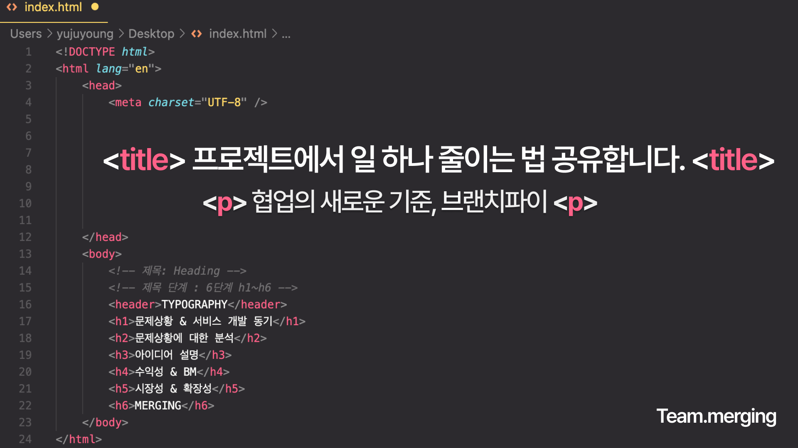
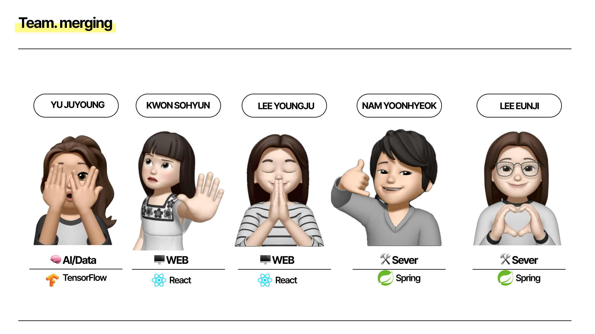
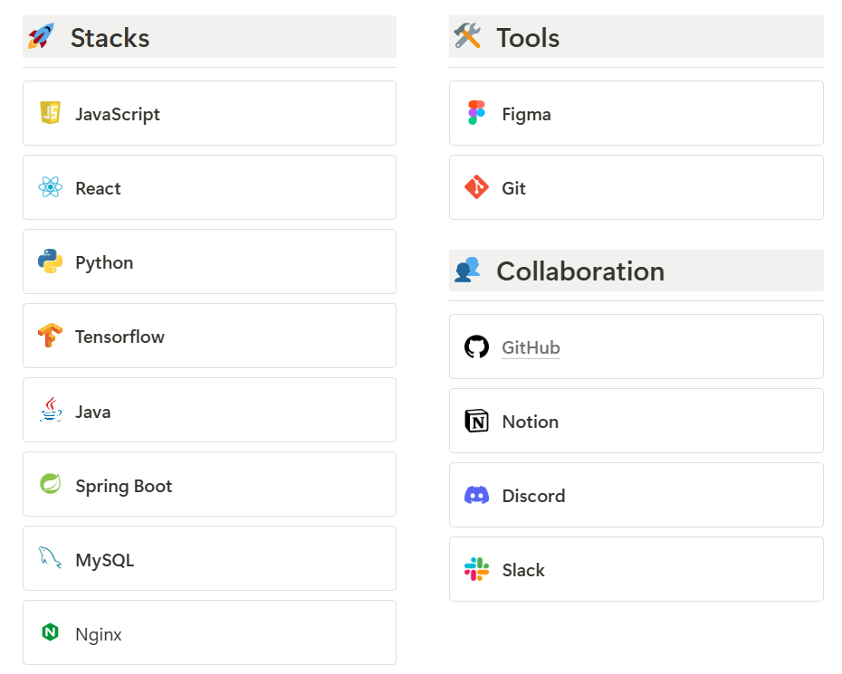
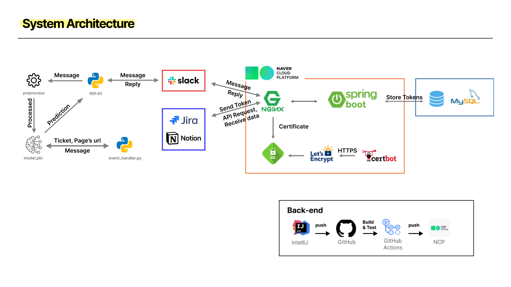

# 🕊️ Branchify

### 협업의 새로운 기준, Branchify



## 팀 소개

인하대학교 창업지원단 제12회 아랩 액셀러레이팅 프로그램 소속, **팀 merging** 입니다.


| 유주영                                                        | 권소현                                                        | 이영주                                                | 남윤혁                                                        | 이은지                                                        |
| ------------------------------------------------------------- | ------------------------------------------------------------- | ----------------------------------------------------- | ------------------------------------------------------------- | ------------------------------------------------------------- |
| AI                                                            | FE                                                            | FE                                                    | BE                                                            | BE                                                            |
|  |  |  |  |  |
| [@Juyounge-e](https://github.com/Juyounge-e)                  | [@hyuke81](https://github.com/hyuke81)                        | [@abyss-s](https://github.com/abyss-s)                | [@namyoonhyeok](https://github.com/namyoonhyeok)              | [@ddmswl](https://github.com/ddmswl)                          |

## 프로젝트 소개

> 프로젝트에 대한 더 자세한 기능 소개 및 문서들을 보고싶다면?  
> [👋 팀 노션 바로가기](https://www.notion.so/abyss-2/MERGING-168ab69bd42a804e9a21f535e0468e85)

## 기획 및 디자인

> 서비스 프로토타입과 랜딩페이지 자료가 궁금하다면?  
> [👋 팀 피그마 바로가기](https://www.figma.com/design/aF3qFXZrJmRHs1eQnXEcHB/%EC%95%84%EB%9E%A9%EC%8A%A4%ED%83%80%ED%8A%B8%EC%97%85?node-id=0-1)

## 기술 스택



## 시스템 아키텍처



## 프로젝트 실행

```
npm i
npm run dev
```
